# 🍕 PizzaVerse - Custom Pizza Ordering & Inventory Management System

[](https://nodejs.org/)
[](https://expressjs.com/)
[](https://react.dev/)
[](https://www.mongodb.com/)
[](LICENSE)

---

## 📌 Project Overview

**PizzaVerse** is an end-to-end full-stack web application built for ordering customized pizzas online while delivering real-time inventory management for restaurant operational efficiency. The platform allows users to browse menus, build custom pizzas, pay online or via COD, and track order progress live. For restaurant administrators, PizzaVerse features a robust dashboard to manage menus, track orders, adjust stock levels, link pizza recipes to raw ingredients, and automatically deduct stock when orders are delivered.

---

## 🎯 Objective

- Provide customers with an intuitive, interactive pizza ordering platform with real-time status tracking.
- Automate ingredient-level inventory tracking for restaurant managers, eliminating manual stock calculations.
- Ensure high security through role-based access control, JWT authentication, email verification, and payment signature verification.

---

## ✨ Features

- 🔐 **Secure Authentication**: JWT-based auth with password hashing and email verification.
- 🍕 **Interactive Pizza Menu**: Filterable menu with size, crust, and topping customization.
- 🛒 **Dynamic Cart & Checkout**: Real-time totals, GST, free delivery logic, and Razorpay/COD integration.
- 🚚 **Order Tracking**: Customer order history with step-by-step progress status.
- 👨‍💼 **Admin Portal**: Sales analytics dashboard, order status pipeline, inventory manager, and recipe configurator.
- 🔄 **Automated Stock Deduction**: Automatic ingredient deduction when orders transition to "Delivered".

---

## 👤 Customer Functionality

- **User Registration & Email Verification**: Create an account and verify via link sent to email.
- **Authentication**: Secure login with JWT tokens and password reset via email.
- **Menu & Customization**: Filter veg/non-veg pizzas, select pizza size, crust type, and extra toppings.
- **Cart Management**: Add/remove items, update quantities, view real-time subtotal, GST (5%), and delivery fees.
- **Multiple Delivery Addresses**: Save, edit, and set default delivery addresses in user profile.
- **Flexible Payments**: Pay via Cash on Delivery (COD) or Razorpay Payment Gateway.
- **Order Tracking**: View past orders and track current status from preparation to delivery.

---

## 👨‍💼 Admin Functionality

- **Dashboard Analytics**: View total sales revenue, active order counts, customer metrics, and low-stock alerts.
- **Order Pipeline Management**: View all customer orders and update status (`Order Received` ➔ `In Kitchen` ➔ `Sent to Delivery` ➔ `Delivered`).
- **Inventory Control**: Add raw ingredients, update stock quantities, specify units, set low-stock alert thresholds.
- **Recipe Management**: Link raw inventory ingredients and exact quantities to specific pizza menu items.

---

## 🔐 Authentication & JWT

- **Stateless Tokens**: Employs JSON Web Tokens (JWT) signed with a secret key for authenticating API requests.
- **Role-Based Authorization**: Route middleware (`protect` and `adminOnly`) enforces endpoint access based on user role (`user` vs `admin`).
- **Password Security**: Passwords are salted and hashed using `bcryptjs` before storage.

---

## 📧 Email Verification

- Integrates `Nodemailer` to send branded HTML emails with unique cryptographic verification tokens upon registration.
- Account status `isVerified` remains `false` until the link is accessed, blocking unauthorized access.
- Tokens automatically expire after 24 hours.

---

## 🔑 Forgot Password

- Password reset workflow generates a 32-byte secure random token hashed with SHA-256.
- A reset URL valid for 15 minutes is dispatched to the user's registered email address.
- Designed to prevent user enumeration attack vectors by returning uniform responses.

---

## 🛒 Cart & Checkout

- **State Management**: Dynamic client-side state powered by Redux Toolkit for seamless cart operations.
- **Automated Billing Engine**:
  - Subtotal computation based on unit prices and quantities.
  - 5% GST calculation.
  - Delivery charge logic (Free delivery for orders $\ge$ ₹299, otherwise ₹40).
- **Payment Options**: Cash on Delivery (COD) or instant online payment via Razorpay.

---

## 📦 Order Management

- Complete audit trail of customer purchases with itemized breakdowns, custom options, totals, and payment status.
- Admin order dashboard allows real-time status progression through four key states:
  1. `Order Received`
  2. `In Kitchen`
  3. `Sent to Delivery`
  4. `Delivered`

---

## 🚚 Order Tracking

- Customer order tracking page provides visual status badges for every active order.
- Status updates in real-time as the admin updates the order status in the backend.

---

## 🍕 Pizza Recipe Management

- Map each pizza item to its required raw material inventory ingredients.
- Specify precise unit quantities (e.g., Farmhouse Pizza = 1 Base, 1 Box, 1 Cheese, 0.05kg Onions, 0.05kg Capsicum, 0.10kg Tomatoes, 0.05kg Mushrooms).
- Serves as the blueprint for automated ingredient stock deduction.

---

## 📊 Inventory Management

- Centralized management of raw ingredients (Bases, Cheese, Vegetables, Meats, Boxes, Sauces).
- Configurable low-stock threshold per item to trigger administrative warning indicators.
- Full CRUD operations available for admins to manage stock inventory.

---

## 🔄 Automatic Stock Deduction

- **Trigger Event**: Executes automatically when an admin sets an order status to **"Delivered"**.
- **Execution Mechanism**:
  1. Retrieves all item recipes for pizzas in the delivered order.
  2. Calculates cumulative raw ingredient consumption.
  3. Checks inventory availability against required quantities.
  4. Performs atomic MongoDB `bulkWrite` operations with `$inc` negative quantities.
  5. Marks `stockDeducted: true` and records `stockDeductedAt` timestamp on the order.

---

## 🛠️ Tech Stack

### Frontend

- **Framework**: React 19 + Vite
- **State Management**: Redux Toolkit & React-Redux
- **Routing**: React Router DOM v7
- **Animations & Icons**: Framer Motion, React Icons
- **Notifications**: React Hot Toast
- **HTTP Client**: Axios

### Backend

- **Runtime**: Node.js
- **Framework**: Express.js (v5)
- **Database**: MongoDB with Mongoose ODM (v9)
- **Security & Auth**: JWT (`jsonwebtoken`), `bcryptjs`, Express Validator
- **Email Service**: Nodemailer
- **Payments**: Razorpay Node SDK & crypto signature verification

---

## 🏗️ Project Architecture

PizzaVerse/
├── client/                     # Frontend React Application

│   ├── src/

│   │   ├── app/                # Redux store configuration

│   │   ├── components/         # Reusable UI components (Navbar, Footer, Modals)

│   │   ├── features/           # Redux slices (auth, cart, orders)

│   │   ├── pages/              # View pages (Home, Menu, Cart, Checkout, Admin, etc.)

│   │   ├── utils/              # API helpers and axios configuration

│   │   ├── App.jsx             # Main router configuration

│   │   └── main.jsx            # Application entry point

│   ├── package.json

│   └── vite.config.js

│

├── server/                     # Backend Express API

│   ├── config/                 # Database configuration (db.js)

│   ├── controllers/            # Route controllers (auth, order, inventory, recipe)

│   ├── middleware/             # Auth & Admin route guards

│   ├── models/                 # Mongoose Schemas (User, Order, Inventory, PizzaRecipe, Pizza)

│   ├── routes/                 # Express API routes

│   ├── utils/                  # Mailer and token utilities

│   ├── seedPizzaRecipes.js     # Recipe seeder script

│   ├── createAdmin.js          # Admin account setup script

│   ├── createInventory.js      # Inventory seeder script

│   ├── server.js               # Express server entry point

│   └── package.json

│

└── README.md                   # Project documentation

## ⚙️ Installation / Setup

### 1. Prerequisites

- Node.js (v18 or higher)
- MongoDB installed locally or MongoDB Atlas connection string
- Git

### 2. Clone the Repository

bash
git clone https://github.com/Yashwitha815/PizzaVerse.git
cd PizzaVerse

### 3. Server Setup

bash
cd server
npm install

Create a `.env` file in the `server` directory with the following variables:

```env
PORT=5000
MONGO_URI=mongodb://localhost:27017/pizzaverse
JWT_SECRET=your_jwt_secret_key_here
CLIENT_URL=http://localhost:5173
EMAIL_HOST=smtp.gmail.com
EMAIL_PORT=587
EMAIL_USER=your_email@gmail.com
EMAIL_PASS=your_email_app_password
RAZORPAY_KEY_ID=your_razorpay_key_id
RAZORPAY_KEY_SECRET=your_razorpay_key_secret
```

Seed initial data (optional but recommended):

```bash
node createAdmin.js
node createInventory.js
node seedPizzaRecipes.js
```

Start the backend server:

```bash
npm run dev
```

### 4. Client Setup

Open a new terminal window:

```bash
cd client
npm install
npm run dev
```

The app will be available at `http://localhost:5173`.

---

## 🧪 Testing

- **Backend API Testing**: Use Postman or cURL to test API endpoints (`/api/auth`, `/api/orders`, `/api/inventory`, `/api/recipes`).
- **Authentication Testing**: Register a new user, verify email link, test invalid credentials, and verify route protection.
- **Stock Deduction Verification**: Place an order, change status to "Delivered" in Admin panel, and check stock reduction in Inventory.
- **Payment Verification**: Test Razorpay checkout in test mode and COD flow.

---

## 📸 Screenshots Section

### 🏠 Home Page Hero

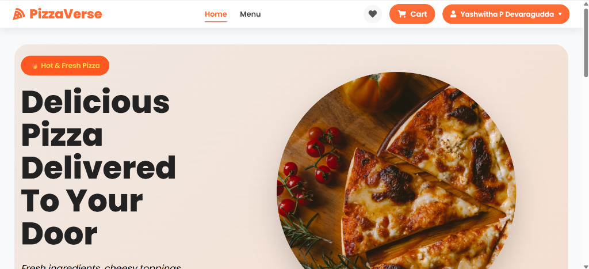

### 🍕 Pizza Menu & Customization

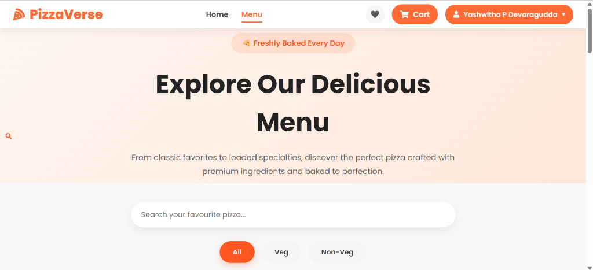

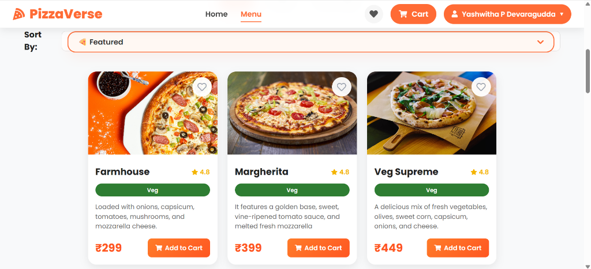

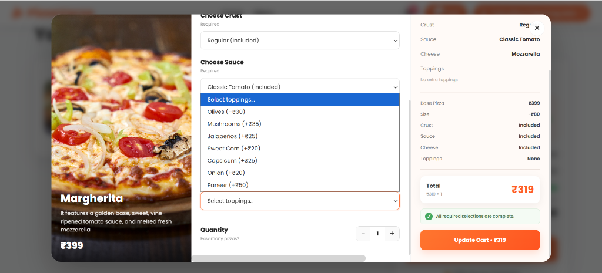

### 🛒 Cart & Quick Checkout Bar

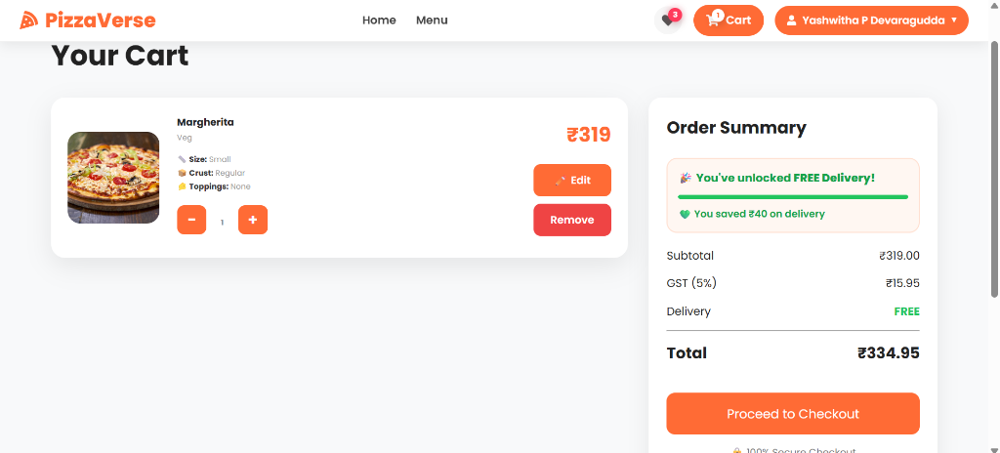

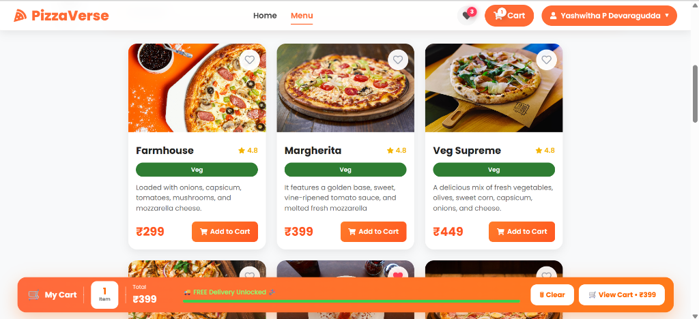

### 👨‍💼User Profile

)


### 💳 Checkout & Razorpay Payment Sandbox

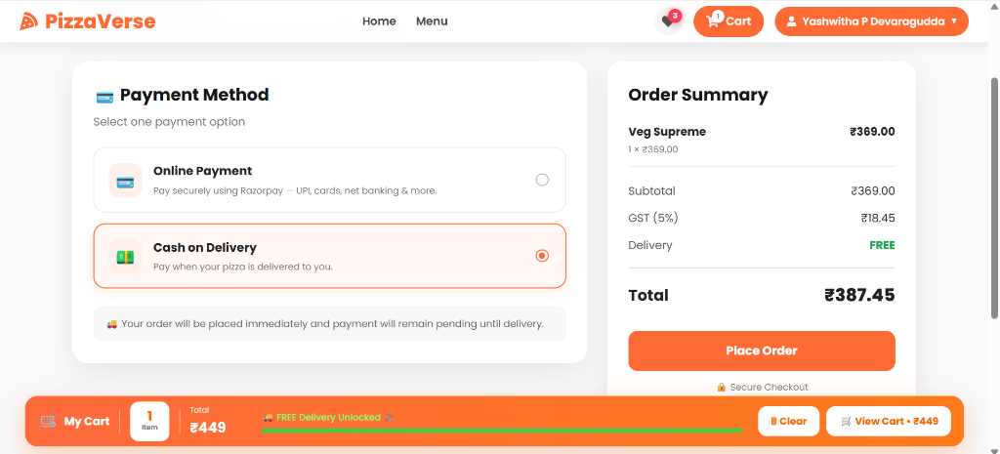

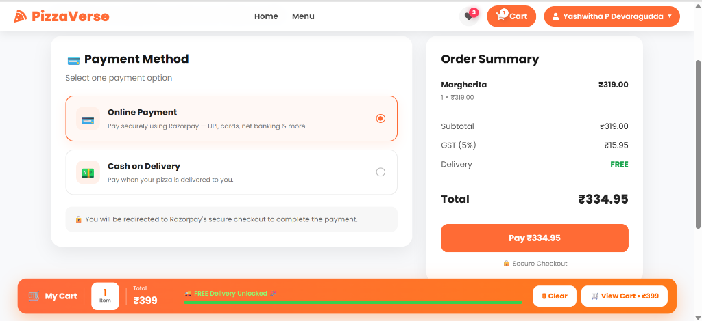

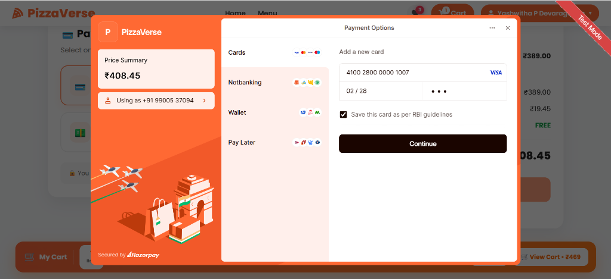

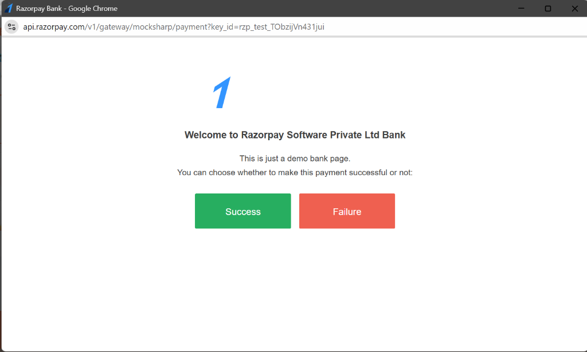

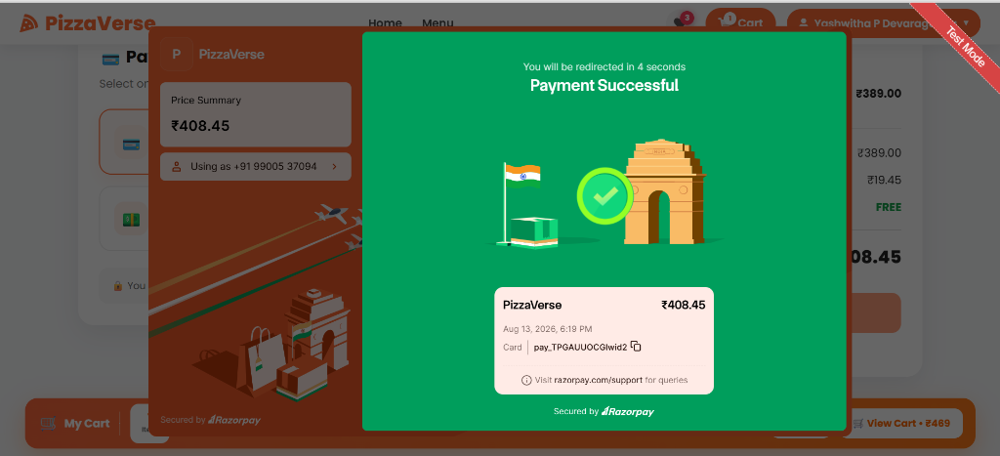

### 🎉 Order Confirmation & Live Tracking

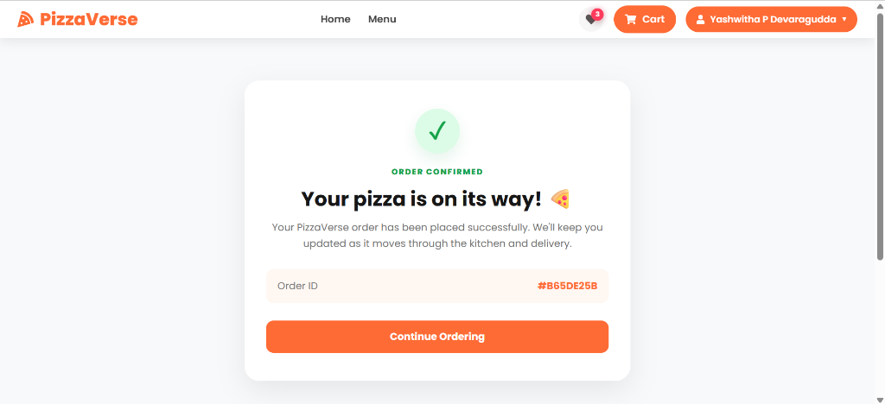

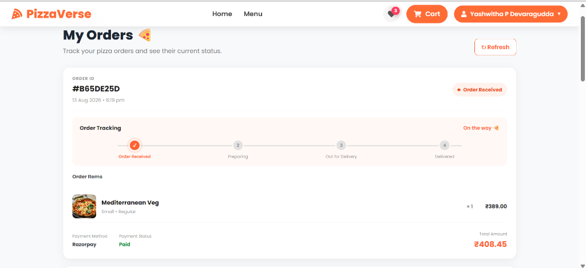

### 👨‍💼 Admin Portal, Orders, Recipes & Inventory Management

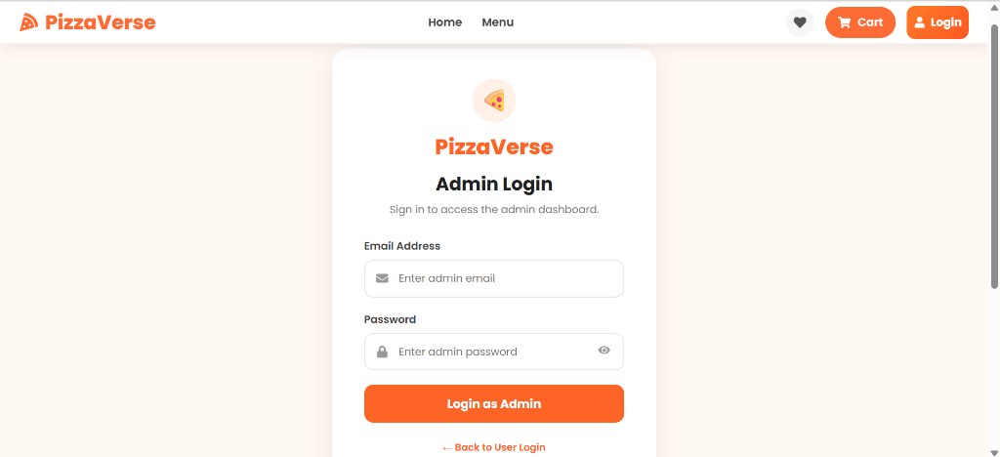

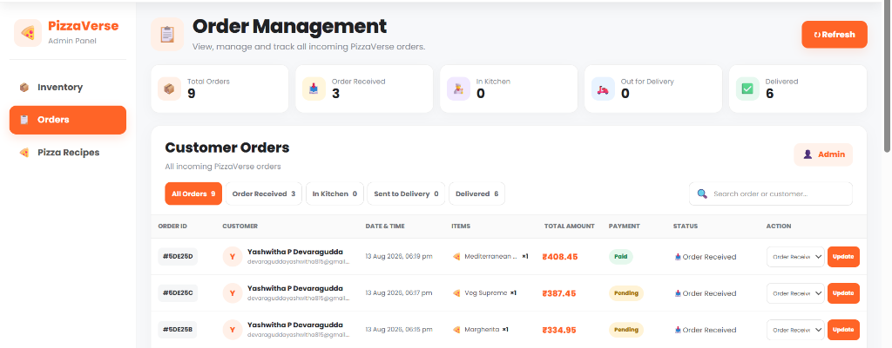

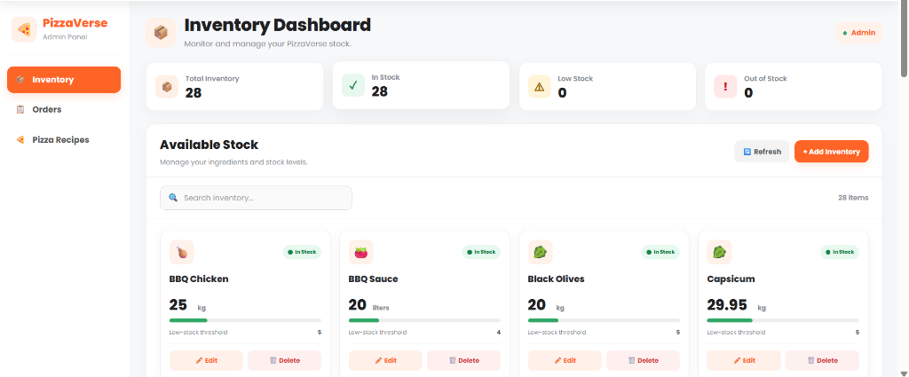

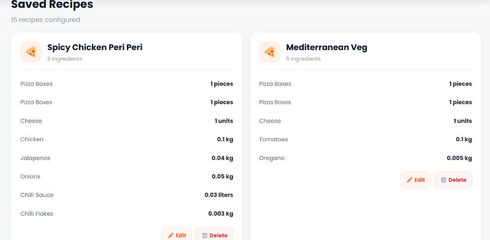

### ❤️ My Wishlist

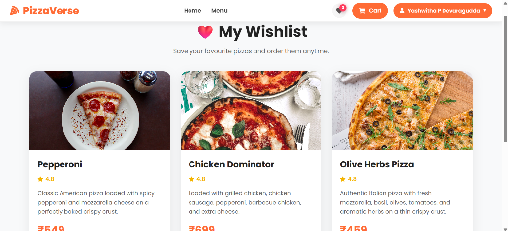

### 📝 User Registration & Login

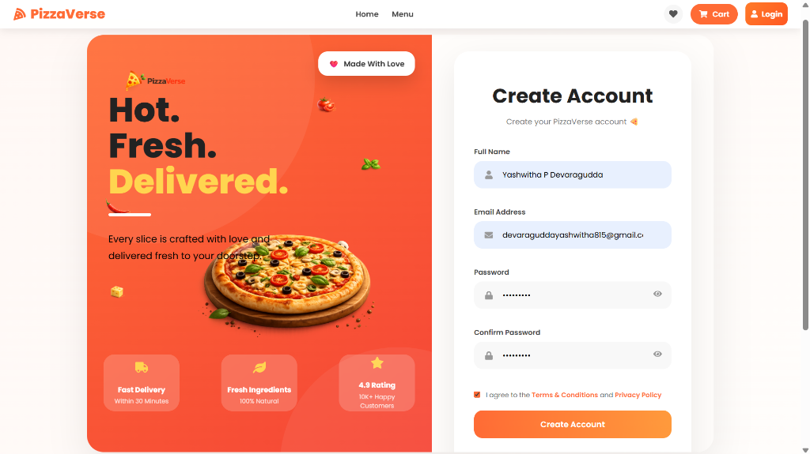

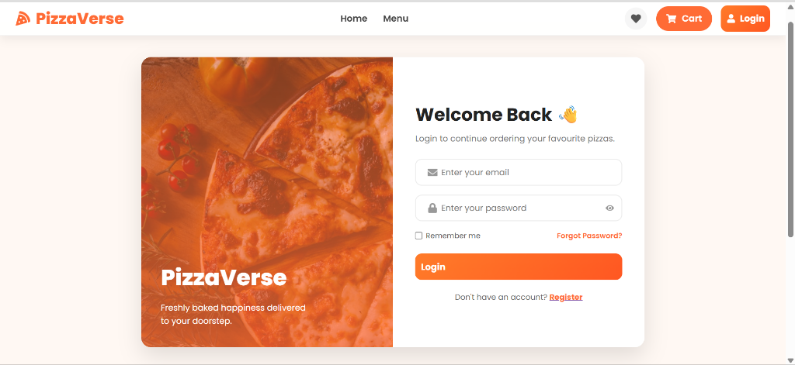

### 📌 Footer & Contact Info

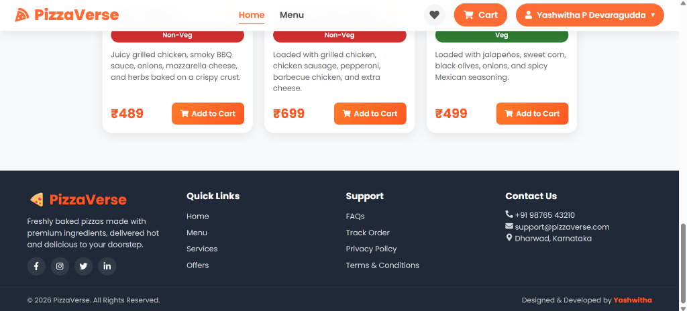

---

## 🚀 Future Enhancements

- 🔔 **Real-Time Push Notifications**: WebSockets / Socket.io for live order status and instant admin stock alerts.
- 🎟️ **Coupon & Discount Engine**: Promotional promo code redemption during checkout.
- 📍 **Live GPS Driver Tracking**: Map view integration for tracking delivery agents in real-time.
- 📊 **Advanced Analytics & Reports**: Exportable CSV/PDF sales and inventory reports for business intelligence.
- 📱 **Mobile App Version**: React Native mobile app for iOS and Android.

---
